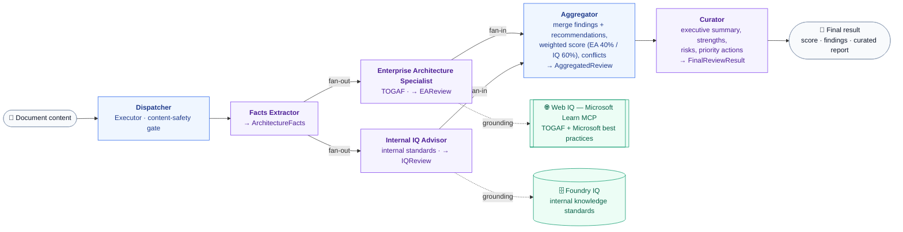

# Enterprise Architecture Advisor — Backend

The Python **FastAPI** service that powers the Architecture Advisor. It exposes the REST API consumed by the UI, persists data in Azure Cosmos DB, stores uploaded documents in Azure Blob Storage, and runs background workers that process documents and generate AI architecture reviews via Azure Service Bus queues.

> This is the backend half of the project. For the React UI see [`../frontend/README.md`](../frontend/README.md). For the high-level overview of how the two halves fit together, see the [root README](../README.md).

---

## Responsibilities

- Serve the REST API (`/api/*`) used by the frontend.
- Persist projects, documents, and reviews in **Azure Cosmos DB**.
- Store uploaded architecture documents in **Azure Blob Storage**.
- Queue and process long-running work through **Azure Service Bus** (decoupled from the request/response cycle).
- Run two always-on background workers: document processing and agentic review.
- Aggregate raw Cosmos items into UI-friendly (camelCase) DTOs.

---

## Technology Stack

| Technology | Version | Purpose |
|-----------|---------|---------|
| Python | ≥3.13 | Runtime |
| FastAPI | ≥0.133.0 | Web framework |
| Pydantic | ≥2.14.0a1 | Data validation / DTOs |
| Uvicorn | ≥0.49.0 | ASGI server |
| `azure-cosmos` | ≥4.16.1 | Cosmos DB (document database) |
| `azure-servicebus` | ≥7.14.3 | Async messaging |
| `azure-storage-blob` | ≥12.30.0b1 | File storage |
| `azure-identity` | (bundled) | Keyless authentication |
| `agent-framework` | ≥1.7.0 | **Microsoft Agent Framework** — multi-agent review workflow |
| `tenacity` | ≥9.1.4 | Retry/back-off for agent model calls |

---

## Project Structure

```
backend/
├── main.py                       # App entry point, CORS, router registration, worker lifespan
├── config.py                     # Pydantic BaseSettings (env-driven configuration)
├── pyproject.toml                # Python dependencies
├── api/
│   ├── models/                   # Pydantic models
│   │   ├── project.py            # Project, ProjectCreateResponse
│   │   ├── document.py           # Document model
│   │   ├── review.py             # Review (facts, findings, recommendations, report)
│   │   ├── findings.py           # Finding model
│   │   └── summaries.py          # UI-facing camelCase DTOs (ProjectSummary, ReviewSummary, …)
│   ├── routes/                   # API endpoints
│   │   ├── projects.py
│   │   ├── document.py
│   │   ├── reviews.py
│   │   ├── findings.py
│   │   └── analytics.py
│   ├── services/                 # Azure service abstractions + read/mapping helpers
│   │   ├── cosmos_db.py          # CosmosDbService
│   │   ├── blob_storage.py       # BlobStorageService
│   │   ├── publisher.py          # ServiceBusQueuePublisher
│   │   ├── consumer.py           # ServiceBusQueueConsumer (base class)
│   │   └── store.py              # Fetch helpers + Cosmos→DTO mappers + analytics aggregation
│   └── utils/
│       └── dependencies.py       # FastAPI dependencies (ProjectDependency, DocumentDependency)
├── orchestration/                # Multi-agent review workflow (Microsoft Agent Framework)
│   ├── workflow.py               # WorkflowBuilder graph: dispatcher → facts → [EA, IQ] → aggregator → curator
│   └── agents/
│       ├── dispatcher.py         # Entry Executor (content-safety gate)
│       ├── aggregator.py         # Fan-in Executor: merge reviews, weighted score, conflicts
│       ├── auto_retry.py         # RateLimitRetryMiddleware (tenacity exponential back-off)
│       ├── state/                # Typed Pydantic contracts (ArchitectureFacts, EAReview, IQReview, …)
│       ├── models/               # Model id constants (DISPATCHER_MODEL, …)
│       └── prompts/system/       # Per-agent system prompts (ARCHITECTURE_FACTS, EA_REVIEWER, IQ_REVIEWER, …)
└── worker/                       # Background job handlers (Service Bus consumers)
    ├── document_processing.py    # DocumentProcessing worker
    └── agentic_review.py         # AgenticReview worker (drives the orchestration workflow)
```

---

## Application Layout

**`main.py`** wires everything together:

- Registers routers under the `/api` prefix: `documents`, `projects`, `reviews`, `findings`, `analytics`.
- Adds permissive CORS for local development (`allow_origins=["*"]`).
- Uses a FastAPI **lifespan** to launch the two background workers as `asyncio` tasks on startup and cancel them on shutdown.

```python
document_worker = DocumentProcessing(queue_name="document-processing")
agentic_review  = AgenticReview(queue_name="reviews-processing")
```

### Services (`api/services/`)

1. **CosmosDbService** – thin async wrapper over Cosmos containers (`get_item`, `create_item`, `upsert_item`, `query_items`, `patch_item`, …).
2. **BlobStorageService** – uploads document bytes and reads blob text back.
3. **ServiceBusQueuePublisher** – publishes JSON messages to a queue.
4. **ServiceBusQueueConsumer** – base consumer loop; workers subclass it and implement `process_message`.
5. **store.py** – read helpers (`fetch_all_projects`, `documents_for_project`, …) and the mappers (`map_project`, `map_document`, `map_review`, `map_findings`, `build_analytics`) that shape raw Cosmos items into camelCase DTOs.

### Workers (`worker/`)

Started automatically by `main.py`:

1. **DocumentProcessing** – consumes `document-processing`, extracts/classifies content, updates document status.
2. **AgenticReview** – consumes `reviews-processing`, drives the **multi-agent review workflow** (see [Agent Orchestration](#agent-orchestration--microsoft-agent-framework-on-azure-ai-foundry)), and streams results into the `Review` container.

---

## Agent Orchestration — Microsoft Agent Framework on Azure AI Foundry

The heart of the product lives in **`orchestration/`**. Instead of a single monolithic prompt, the architecture review is produced by a **graph of specialized agents** built with the **[Microsoft Agent Framework](https://github.com/microsoft/agent-framework)** (`agent_framework`). The framework gives us a deterministic, observable, and fault-tolerant way to coordinate several domain experts — and runs on top of **Azure AI Foundry** as the managed model/agent runtime.

### Why Microsoft Agent Framework

It directly addresses the things that make multi-agent systems unreliable:

| Concern | How the framework solves it (in this code) |
|---------|--------------------------------------------|
| **Free-text drift** | Every agent declares a **typed output** via `ChatOptions(response_format=<PydanticModel>)`. Each hop is schema-validated, so downstream agents receive structured data, never prose to re-parse. |
| **Transient model failures** | A custom **`RateLimitRetryMiddleware`** (tenacity, exponential back-off) wraps every model call; rate-limit errors are retried independently per agent and per tool-loop step. |
| **Non-determinism / coordination** | The pipeline is an explicit **`WorkflowBuilder`** graph with typed edges and **fan-out / fan-in**, so the parallel reviews run predictably and converge at a single join. |
| **Observability** | The workflow emits **streaming `executor_completed` events**; the worker maps each to a `ReviewStatus` and patches it to Cosmos in real time, so the UI tracks progress step-by-step. |
| **Grounding** | Agents attach **tools** (e.g. the Microsoft Learn MCP server) and can plug in retrieval context providers, so reviews are grounded in authoritative sources, not model memory. |
| **Extensibility** | Adding a new domain specialist is one `Agent` + two edges — no rewrite of the pipeline. |

### The workflow graph (`workflow.py`)

The review is a directed graph: the facts extractor **fans out** to two independent domain specialists that run in parallel — each grounded by its own knowledge source — then their results **fan in** to the aggregator and are distilled by the curator.



> **Legend** — blue = framework `Executor` (dispatcher, aggregator) · purple = LLM `Agent` (facts, EA, IQ, curator) · green = external grounding source (Web IQ via Microsoft Learn MCP, Foundry IQ via the internal knowledge base) · solid arrows = workflow edges · dotted arrows = retrieval/grounding.

Built declaratively:

```python
WorkflowBuilder(name="Enterp Architecture Advisor", start_executor=dispatcher)
    .add_edge(source=dispatcher, target=architecture_facts_extractor)
    .add_fan_out_edges(architecture_facts_extractor, [enterprise_arch_reviewer, internal_iq_advisor])
    .add_fan_in_edges([enterprise_arch_reviewer, internal_iq_advisor], aggregator)
    .add_edge(source=aggregator, target=curator)
    .build()
```

### The domain-specialized agents

Each stage is a focused expert with its own system prompt (`orchestration/agents/prompts/system/`) and typed contract — easy to reason about, test, and swap:

| Agent | Type | Domain responsibility | Output model |
|-------|------|-----------------------|--------------|
| **Dispatcher** | `Executor` | Entry point; guardrail hook for content-safety validation before any model runs | `str` (document content) |
| **Architecture Facts Extractor** | `Agent` | Normalizes the raw document into structured facts (auth, availability, technology, stakeholders); **extracts only — never scores or critiques** | `ArchitectureFacts` |
| **Enterprise Architecture Reviewer** | `Agent` | **TOGAF-aligned** EA review; grounds recommendations with the **Microsoft Learn MCP** tool | `EAReview` |
| **Internal IQ Advisor** | `Agent` | Compliance against **internal standards, approved technologies & governance**; emits policy `violations` | `IQReview` |
| **Aggregator** | `Executor` | Merges findings & recommendations from both reviewers, computes a **weighted overall score (EA 40% / IQ 60%)**, flags conflicts | `AggregatedReview` |
| **Curator** | `Agent` | Distills everything into an executive **curated report** (summary, strengths, risks, priority actions) | `FinalReviewResult` → `CuratedReport` |

Because the two reviewers are **independent specialists running in parallel**, you can add more domains (e.g. a security/Zero-Trust reviewer, a FinOps cost reviewer) by registering another `Agent` and wiring it into the fan-out/fan-in — the aggregator and curator absorb the extra signal without structural changes.

### Typed state contracts (`agents/state/`)

The Pydantic models are the reliability backbone — they are the *interface* between agents:

`ArchitectureFacts` → `EAReview` / `IQReview` → `AggregatedReview` → `CuratedReport` → `FinalReviewResult`

A parallel `ReviewStatus` enum and `StateMap` map every executor id to a lifecycle status:

`started → facts_extracted → ea_review_complete / iq_review_complete → aggregated → curated → completed`

### Azure AI Foundry integration

Microsoft Agent Framework abstracts the model backend behind a **chat client**, so the same agent graph runs on **Azure AI Foundry**-hosted models and agents:

```python
# Foundry-hosted models/agents (managed, keyless via DefaultAzureCredential):
# from agent_framework.foundry import FoundryChatClient
chat_client = OpenAIChatClient(model=model.DISPATCHER_MODEL)   # ← single swap point
```

The chat client is the **one place** to point the whole workflow at Azure AI Foundry — every agent is constructed with it. This keeps Foundry's managed hosting, keyless auth (`DefaultAzureCredential`), and built-in governance consistent with the rest of the backend's Azure-native, no-API-keys posture. Grounding is layered on top: the EA reviewer calls the **Microsoft Learn MCP** server today, and the IQ advisor is designed to ground against an internal knowledge base (e.g. an Azure AI Search context provider) for organization-specific standards.

### How the worker drives it (`worker/agentic_review.py`)

```python
workflow = review_workflow()
async for event in workflow.run(document_content, stream=True):
    if event.type == "executor_completed":
        status = StateMap[event.executor_id].value
        await self.update_status(review_id, status)          # live progress → Cosmos
        if event.executor_id == StateMap.review_curator.name:
            result = event.data[0].agent_response.value      # FinalReviewResult
            # persist score, facts, findings, recommendations, curated report
```

So a single uploaded document flows: **Blob → workflow graph → streamed status updates → final `Review` (score + findings + curated report) in Cosmos**, which the API then serves to the UI.

---

## Security & Microsoft Best Practices

### 1. No API Keys in Code ✅
Every Azure client authenticates with **`DefaultAzureCredential`** — no keys, no connection strings in source.

```python
# CosmosDbService, BlobStorageService, ServiceBus* all use:
credential = DefaultAzureCredential()
```

The credential chain resolves automatically: managed identity in Azure, or your `az login` token locally.

**Local auth setup:**
```bash
az login
az account get-access-token   # caches a token the SDK picks up
```

### 2. Strict Role-Based Access Control (RBAC) ✅
Access is granted to the app's identity via Azure role assignments, scoped to the specific resources:

| Resource | Role | Notes |
|----------|------|-------|
| Cosmos DB | `Cosmos DB Data Contributor` | Data-plane only — no master/admin keys |
| Blob Storage | `Storage Blob Data Contributor` | Scoped to the `architecture-documents` container |
| Service Bus (publish) | `Azure Service Bus Data Sender` | Sending only |
| Service Bus (consume) | `Azure Service Bus Data Receiver` | Receiving only |

Benefits: fine-grained access, full audit trail in Azure Activity Log, instant revocation by removing a role assignment.

### 3. Local Authentication Disabled ✅
There is no local username/password auth and no token-validation middleware. In production, authentication is expected to be handled upstream (Azure API Management, Entra ID, or network-level controls). When deploying, enable Entra ID auth at the gateway/App Service level and add header validation if required.

### 4. Configuration Management
Settings are externalized through **Pydantic `BaseSettings`** in `config.py`:

```python
class Settings(BaseSettings):
    storage_account_name: str = "..."
    cosmos_db_url: str = "..."
    # ...
    class Config:
        env_file = ".env"   # local dev only
```

- **Development:** values from a local `.env` (git-ignored).
- **Production:** values injected as environment variables by the hosting infrastructure.

---

## Data Processing Workflow

```
1. UPLOAD          POST /api/project/{projectId}/documents
                   → save file to Blob Storage
                   → create Document (status: "Pending") in Cosmos
                   → return document_id + blob_url

2. QUEUE           publish { document_id, project_id, blob_url }
                   to Service Bus queue "document-processing"

3. DOC WORKER      DocumentProcessing consumes the message
                   → fetch blob, extract + classify content
                   → status: "Processing" → "ContentExtracted"
                   → enqueue "reviews-processing"

4. REVIEW WORKER   AgenticReview consumes the message
                   → run the multi-agent workflow (see Agent Orchestration):
                     facts → [EA review ‖ IQ review] → aggregate → curate
                   → stream per-step status, persist Review (score, findings, report)
                   → document status → "Completed"

5. UI REFRESH      frontend polls GET /api/projects/{id}
                   → updated counts, statuses, scores surface in the UI
```

### Document status lifecycle
`Pending → Processing → ContentExtracted → Completed` (or `Failed`).

### Review status lifecycle
`in_progress → completed` (or `failed`).

---

## Database Schema (Cosmos containers)

**Projects**
```json
{
  "id": "uuid",
  "display_name": "Social Media System",
  "description": "Azure-based scalable social media platform",
  "tags": ["social-media", "azure", "microservices"],
  "author_name": "Paulo",
  "author_email": "paulo@example.com",
  "created_at": "2026-06-13T10:30:00Z"
}
```

**Documents**
```json
{
  "id": "uuid",
  "project_id": "uuid",
  "file_name": "architecture.pdf",
  "file_format": "PDF",
  "blob_url": "https://storage.blob.core.windows.net/...",
  "status": "ContentExtracted",
  "created_at": "2026-06-13T10:30:00Z"
}
```

**Reviews**
```json
{
  "id": "uuid",
  "project_id": "uuid",
  "document_id": "uuid",
  "score": 81,
  "facts": { "system_name": "...", "authentication": { "provider": "Microsoft Entra ID" }, "...": "..." },
  "findings": [
    { "severity": "high", "area": "security", "title": "...", "message": "...", "recommendation": "..." }
  ],
  "recommendations": [ { "title": "...", "content": "...", "references": [] } ],
  "report": {
    "status": "curated",
    "executive_summary": "...",
    "strengths": ["..."],
    "risks": ["..."],
    "priority_actions": ["..."],
    "references": []
  },
  "status": "completed",
  "completed_at": "2026-06-13T18:45:30Z",
  "created_at": "2026-06-13T18:43:47Z"
}
```

> **Findings are stored inside the Review document** (denormalized). Analytics are computed on the fly from the aggregated reviews.

---

## API Endpoints

All endpoints are served under the `/api` prefix.

### Projects
| Method | Path | Description |
|--------|------|-------------|
| `POST` | `/api/project` | Create a project (`project_name`, optional `description`) |
| `GET`  | `/api/projects` | List projects enriched with counts, scores, finding tallies |
| `GET`  | `/api/projects/{project_id}` | A single enriched project summary |
| `GET`  | `/api/project/{project_id}` | Raw project document |

### Documents
| Method | Path | Description |
|--------|------|-------------|
| `GET`  | `/api/documents` | All documents across projects |
| `GET`  | `/api/project/{project_id}/document` | Documents for one project |
| `POST` | `/api/project/{project_id}/documents` | Upload a document (multipart `file`) |

### Reviews
| Method | Path | Description |
|--------|------|-------------|
| `GET`  | `/api/reviews` | All reviews (joined with document + project names, includes curated `report`) |
| `POST` | `/api/project/{project_id}/document/{document_id}/review` | Create + queue a review |

### Findings & Analytics
| Method | Path | Description |
|--------|------|-------------|
| `GET`  | `/api/findings` | All findings across projects |
| `GET`  | `/api/analytics` | Dashboard data (KPIs, trends, category slices, leaderboard) |

Interactive docs are available at `http://127.0.0.1:8080/docs` while the server runs.

---

## Getting Started

### Prerequisites
- Python **3.13+**
- **Azure CLI** (`az login`) for local authentication
- An Azure subscription with a Cosmos DB account, Storage account, and Service Bus namespace

### Run locally
```bash
cd backend

# Create + activate a virtual environment
python -m venv .venv
source .venv/bin/activate          # Windows: .venv\Scripts\activate

# Install dependencies (backend/pyproject.toml)
pip install -e .

# Authenticate to Azure (keyless)
az login
az account get-access-token

# Start the API (also launches the background workers)
python main.py
# → http://127.0.0.1:8080  (docs at /docs)
```

> ⚠️ The backend needs reachable Azure resources (Cosmos, Blob, Service Bus) to fully run. Note that `uvicorn` here does **not** hot-reload — restart the process after changing models or services.

### Environment variables
Create `backend/.env` (git-ignored):

```env
STORAGE_ACCOUNT_NAME=saagentsleaguereviewerc
STORAGE_ACCOUNT_CONTAINER_NAME=architecture-documents
COSMOS_DB_URL=https://enterpadvisor.documents.azure.com:443/
COSMOS_DB_ACCOUNT_NAME=ArchitectureAdvisor
SERVICEBUS_NAMESPACE=sb-ai102pkbox-centralindia.servicebus.windows.net
SERVICEBUS_QUEUE=document-processing
```

---

## Deployment (Azure App Service)

```bash
az appservice plan create --name plan-advisor --resource-group rg-advisor --sku B1 --is-linux
az webapp create --name api-advisor --resource-group rg-advisor --plan plan-advisor --runtime "PYTHON|3.13"
```

Assign the App Service's managed identity the RBAC roles listed above, then configure the environment variables as App Settings.

---

## Troubleshooting

| Symptom | Check |
|---------|-------|
| Backend won't start | `az account show`; Cosmos/Service Bus reachable; firewall rules |
| Document stuck in `Processing` | Worker logs; Service Bus queue has messages; worker didn't crash |
| Changes not reflected | Restart `python main.py` — there is no hot reload |
| UI can't reach API | Backend on `127.0.0.1:8080`; CORS enabled in `main.py` |
